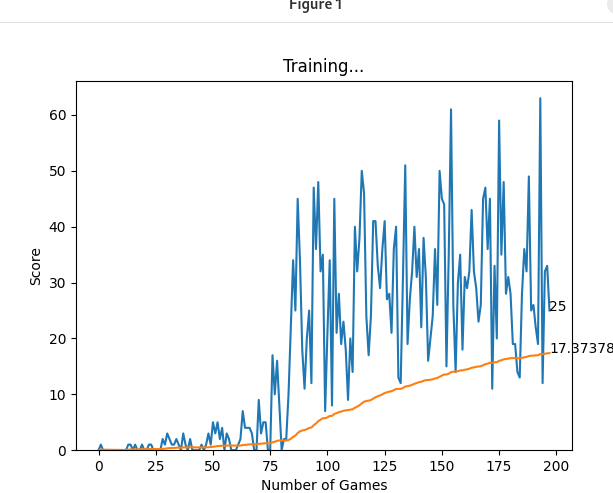
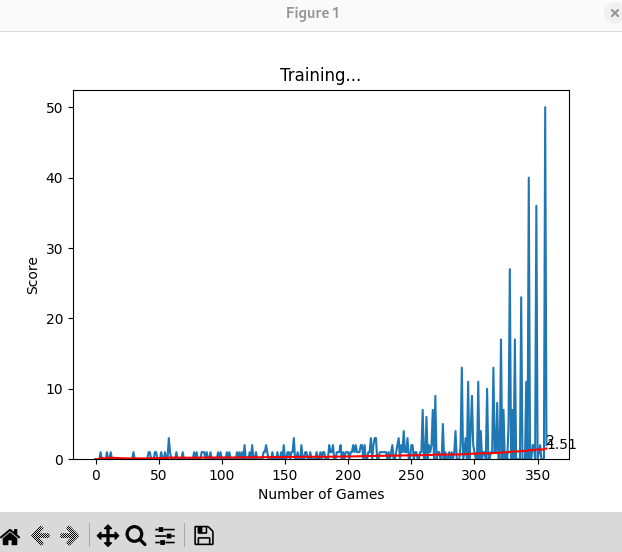
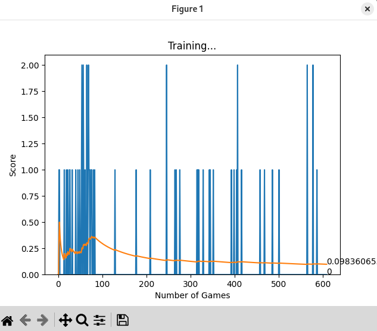

# Benchmark

## Table of Contents

- [Benchmark](#benchmark)
  - [Table of Contents](#table-of-contents)
  - [Main Documentation](#main-documentation)
  - [Benchmark 1](#benchmark-1)
    - [Changes](#changes)
    - [Stats](#stats)
  - [Benchmark 2](#benchmark-2)
    - [Changes](#changes-1)
    - [Stats](#stats-1)
  - [Benchmark 3](#benchmark-3)
    - [Changes](#changes-2)
    - [Stats](#stats-2)

## Main Documentation

- [Main Documentation](../README.md)

## Benchmark 1

### Changes

Original snake with 11 neurons:

- 3 : danger around the snake (1 ex radius)
- 4 : possible direction (UP/DOWN/LEFT/RIGHT)
- 4 : food location boolean (if the food is at the UP/DOWN/LEFT/RIGHT of the snake)

Rewards:

- **Positive :**
  - +1 for each apple eat

- **Negative :**
  - -10 if the snake die or he doesn't eat an apple during a moment

### Stats

## Benchmark 2

### Changes

Original snake with 11 neurons:

- 3 : danger around the snake (1 ex radius)
- 4 : possible direction (UP/DOWN/LEFT/RIGHT)
- 4 : food location boolean (if the food is at the UP/DOWN/LEFT/RIGHT of the snake)

multithreading:
 - 4 process
 - load the best agent each time (agent.pth)
 - use one plot for stat
 - display only the first process

### Stats

## Benchmark 3

### Changes

Snake with 59 neurons:

add 5*5 around the snake's head with the boundary and the if he contain food

### Stats

